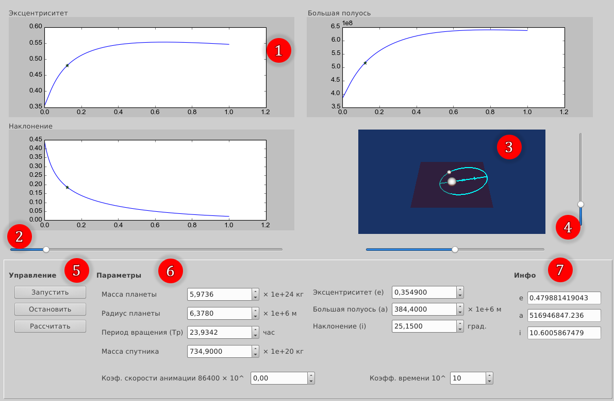
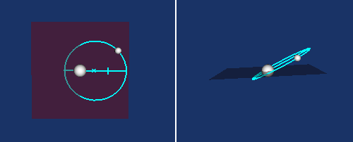
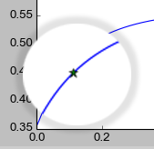
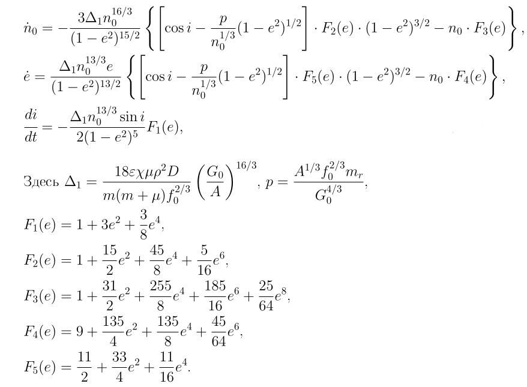

Для исследования эволюционных уравнений движения системы планет-спутник [[1, ур. 5](#Ссылки)]
была разработана программа на языке Python с пользовательским интерфейсом,
обладающая следующими основными возможностями:

* интегрирование системы по заданным начальным условиям;
* построение графиков эволюции параметров орбиты спутника: эксцентриситета 𝑒, 
наклонения 𝑖 и большой полуоси 𝑎 на интервале интегрирования;
* возможность динамического перемещения по интервалу интегрирования с отображением текущей позиции на графиках;
* расчет параметров эксцентриситета 𝑒, наклонения 𝑖 и большой полуоси 𝑎 в выбранный момент времени на интервале интегрирования;
* 3D визуализация модели движения спутника в выбранный
момент времени в зависимости от значений 𝑒, 𝑖 и 𝑎;
* сохранение введенных параметров в файл и их загрузка.

[Пример работы (Youtube)](https://youtu.be/5o-S0pUVdYQ)




Рис. 1. Интерфейс программы 3D визуализации движения спутника


### Инструкция по использованию
Интерфейс программы имеет следующие зоны и компоненты:

1. Графики эволюции параметров 𝑒, 𝑖 и 𝑎 на интервале интегрирования.
2. Слайдер для перемещения по интервалу интегрирования.
3. 3D анимированное изображение движения спутника относительно
планеты.
4. Горизонтальный и вертикальный слайдеры для изменения позиции
наблюдателя (рис. 2). Позволяют вращать сцену по двум осям.
5. Кнопки управления расчетами и анимацией.
6. Исходные параметры для интегрирования и визуализации.
7. Рассчитанные значения для эксцентриситета 𝑒, наклонения 𝑖 и
большой полуоси 𝑎




Рис. 2. Изменение ориентации 3D визуализации движения спутника

Для начала работы необходимо задать начальные значения для системы интегрирования в блоке **Параметры** `(6)`. 

Описание и масштаб величин:

* Масса планеты (𝑚𝑝) - 10<sup>24</sup> кг

* Радиус планеты (𝑟0) - 10<sup>6</sup> м

* Период обращения спутника (𝑇 𝑝) - часы

* Масса спутника (𝑚𝑠) - 10<sup>24</sup> кг

* Эксцентриситет орбиты спутника (𝑒)

* Большая полуось орбиты спутника (𝑎) - 10<sup>6</sup> м

* Наклонение орбиты спутника (𝑖) - градусы

* Коэффициент времени (𝑟0) - 10 в указанной степени секунд - задает
конечное значение времени для интервала интегрирования, начальное - 0

* Коэффициент скорости анимации (𝑡𝑖𝑚𝑒_𝑖𝑛𝑡𝑒𝑔𝑟𝑎𝑡𝑖𝑜𝑛) - 86400×10 в
указанной степени - задает коэффициент для периода обращения спутника.

После установки всех необходимых начальных значений для получения
расчетных значений нужно нажать кнопку «Рассчитать» из блока `(5)`. Для
запуска и остановки анимации имеются соответствующие кнопки «Запустить» и «Остановить». После расчета значений в области `(1)` строятся
графики эволюции параметров 𝑒, 𝑖 и 𝑎 от времени интегрирования.
После запуска анимации для 3D визуализации `(3)` устанавливаются вычисленные значения эксцентриситета и наклонения. Размеры планеты и
спутника, а так же масштаб большой полуоси 𝑎 в `(3)` не зависят от задаваемых параметров. Наклонение, эксцентриситет орбиты соответствуют
расчетным данным, период обращения спутника вокруг планеты задается
в масштабе, указываемом в блоке **Параметры** `(6)`.
Слайдер `(2)` позволяет выбирать конкретное время из интервала интегрирования. 3D визуализация `(3)` и рассчитанные параметры **Инфо** `(4)`
меняются синхронно с перемещением слайдера. Текущее положение на графиках отмечается значком `⋆` (рис. 3).



Рис. 3. Метка текущего положения

Введенные значения в блоке **Параметры** `(6)` можно сохранить в текстовый файл с расширением `.json`, воспользовавшись меню `«Файл» → «Сохранить параметры»`.
Файл можно открыть в любом текстовом редакторе и при
необходимости изменить. Установить параметры из файла можно через
меню `«Файл» → «Загрузить параметры»`.

Пример файла:

```json
{
    "a": 384.4,
    "e": 0.0549,
    "mp": 5.9736,
    "ms": 734.9,
    "i": 5.15,
    "r0": 6.378,
    "speed": 0,
    "Tp": 23.93419,
    "time_integration": 10
}
```

### Системные требования

Программа разработана на языке Python версии 2.7. Для работы необходимо наличие следующих библиотек:

- PyQt4 - графический интерфейс программы;

- VTK 5.8.x - 3D визуализация;

- matplotlib 1.3.x - построение графиков

- scipy 0.13.x, numpy 1.8.x - интегрирование системы уравнений и другие
  расчеты.


### Ссылки

1. Шерстнев Е.В. Моделирование движения спутника в гравитационном поле вращающейся вязкоупругой планеты // Первая научно-техническая конференция Московского технологического университета: электронный сборник трудов конференции, Москва, 2016. с. 295-299


